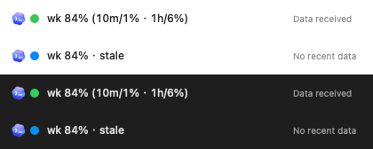
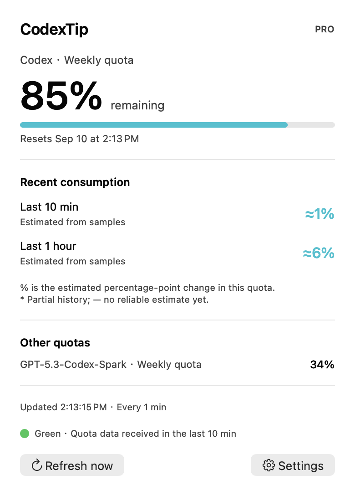

# CodexTip

**A native macOS menu bar app for Codex quota tracking, with English and Simplified Chinese support.**

[简体中文](README.md) · [English](README.en.md)

See your remaining quota and recent consumption over the last 10 minutes, hour, or other periods, directly in the menu bar. No browser window, sound, or Dock icon.

```text
[Codex logo] 🟢 wk 84% (10m/1% · 1h/6%)
```

> The numbers above and the screenshot below are demonstration data. Remaining quota comes from the server; recent consumption is estimated from local samples.





## Features

- **Remaining quota:** percentage, actual quota window, and reset time. Select among the Codex, Spark, or other quotas returned by the server.
- **Logo and status color:** a Codex logo replaces the product text in the menu bar. Its adjacent dot defaults to green when valid quota data has been sampled within the last 10 minutes, and blue otherwise. Dot size and both state colors are configurable. The tooltip and panel also explain the status in text.
- **Recent consumption:** defaults to the last 10 minutes and hour. Choose 5 / 10 / 30 minutes or 1 / 3 / 6 / 24 hours.
- **Adjustable refresh:** every 1, 2, 3, 5, or 10 minutes; defaults to 1 minute. Manual refresh is also available.
- **Bilingual interface:** Chinese and English menu bar labels, dashboard, settings, status messages, and errors. Follow the system language or select one manually.
- **Background operation:** compact display, optional launch at login, and immediate refresh after waking from sleep.
- **Local history:** keeps the last 48 hours of samples and detects account changes, quota resets, and sampling gaps.

CodexTip is a standalone macOS menu bar app. It reads quota through the local Codex App Server; it does not require a Codex plugin-store installation or modify the Codex application.

## Requirements

| Component | Requirement |
| --- | --- |
| Operating system | macOS 13 or later |
| Build tools | Swift 5.9+ from Xcode or Xcode Command Line Tools |
| Codex installation | Codex / ChatGPT desktop app, or a Codex CLI with App Server support |
| Account | Codex signed in with a ChatGPT account that exposes subscription quota; API-key-only accounts do not expose this quota |
| Network | Access to the Codex quota service when refreshing |

There are no third-party Swift package dependencies. Installation currently builds from source for your Mac's architecture. The app has been verified on Apple Silicon; Intel Macs have not been verified.

## Install and launch

If you do not have the command-line developer tools, run this command and complete the system installation prompt first:

```bash
xcode-select --install
```

Clone, build, and install:

```bash
git clone https://github.com/jygameclub/codextip.git
cd codextip
./scripts/install.sh
```

The script installs the app at `~/Applications/CodexTip.app` and starts it in the background. No administrator permission is required. Look for the Codex logo, status dot, and quota numbers in your menu bar.

To build and run without installing:

```bash
./scripts/build.sh
open -g ./dist/CodexTip.app
```

Local builds use an ad-hoc signature for use on your own Mac. Distributing a compiled app to other users requires separate Developer ID signing and notarization setup.

## Settings and language

Click the menu bar quota, then **Settings / 设置**.

| Setting | Options |
| --- | --- |
| 语言 / Language | System / 简体中文 / English; changes take effect immediately and are saved |
| Status dot size | 6, 8, 10, 12, or 14 pt; defaults to 10 pt, including upgrades without an explicit size preference |
| Color when data is available / unavailable | Independently choose green, blue, cyan, orange, purple, red, pink, or yellow; defaults to green / blue |
| Refresh interval | Every 1, 2, 3, 5, or 10 minutes; defaults to 1 minute |
| Recent periods | Up to 3 periods in parentheses; all may be disabled. The panel always includes 10 minutes and 1 hour |
| Quota shown in menu bar | Select a quota actually returned by the server; recent consumption uses that same quota |
| Compact display | Show only remaining quota in the menu bar; details remain in the panel |
| Launch at login | Disabled by default; macOS may require approval in Login Items |
| Choose Codex executable | Select the `codex` executable if automatic discovery fails |

System mode uses Simplified Chinese when your primary system language is Chinese, and English otherwise. Native macOS controls such as the file picker may still follow your system language. Existing settings are preserved when upgrading; the new language preference defaults to System.

Automatic discovery checks Codex / ChatGPT apps in `/Applications` and `~/Applications`, Homebrew locations, `~/.local/bin`, and the process `PATH`. An explicitly selected executable is not silently replaced with a different client.

## Understanding the numbers

| Display | Meaning |
| --- | --- |
| Data available (green by default) | A valid percentage for the selected quota was sampled within the last 10 minutes; zero consumption still counts as data |
| No recent data (blue by default) | No valid sample in the last 10 minutes, such as during startup, a prolonged outage, or extended sleep |
| `84%` | 84% of the selected quota remains |
| `10m/1%` | An estimated 1 percentage point of the total quota was consumed in the last 10 minutes |
| `10m/1%*` | Partial history; only the recorded portion is included. The panel shows how many minutes are covered |
| `—` | No reliable estimate yet: startup, missing data or identity, sampling gap, or a reset during the period |
| `· stale` / `· 旧` | Refresh failed or data expired; the displayed quota is the last successful reading |

The menu bar uses `10m/1%`: period on the left of `/`, estimated consumption on the right. The approximation sign is omitted to save space; the panel still shows `≈1%`, and `*` / `—` retain their meanings. Size and color changes take effect immediately and are saved. The panel and tooltip use the selected color name.

For example, used quota increasing from **15% to 16%** counts as **1 percentage point consumed**, not a relative percentage change in used or remaining quota.

The dot indicates **data received within the last 10 minutes**, not whether consumption increased. After a failed refresh, the dot may retain its data-available color while the text says “stale” if a valid sample is still within that window. Color is recalculated against the current time even without new samples; the display updates approximately every 15 seconds.

- **History starts when the app runs.** A full 10-minute or 1-hour comparison needs that much sampling history. Usage before installation is not reconstructed.
- **Account-wide consumption.** Changes may include usage from other devices using the same account, not just this Mac.
- **Sampling has limited precision.** Refresh frequency, server update delays, and the granularity of returned percentages affect the estimate. A boundary between two valid samples is linearly interpolated.
- **Sleep and network outages create gaps.** No successful sampling occurs while the Mac is asleep, the app is closed, or the network is unavailable. Refresh resumes afterwards. Comparisons recover once gaps, resets, or adjustments fall outside the selected period.
- **Quota windows come from the API.** The primary window may be weekly; it is not assumed to be five hours.

## Data source and privacy

CodexTip uses the interface described in the [OpenAI App Server documentation](https://learn.chatgpt.com/docs/app-server#6-rate-limits-chatgpt):

```text
codex app-server --listen stdio://
initialize → initialized → account/rateLimits/read
```

It prefers `rateLimitsByLimitId` and supports the legacy `rateLimits` response. Remaining quota is calculated from `usedPercent`; window labels and reset times use `windowDurationMins` and `resetsAt`.

- Reads quota only. No task creation, model generation, or quota reset-credit redemption.
- CodexTip itself does not read chat history or read/copy authentication files, and never saves tokens. Authentication and quota requests are handled by the local Codex App Server.
- No HTTP service or TCP listener. No data is uploaded to a project-owned server, and this project has no telemetry service.
- Local history contains quota snapshots, sample times, intervals, and a SHA-256 account identifier for separating accounts. Switching accounts clears the previous comparison history. Missing account identity disables history comparisons.

Local files:

```text
~/Library/Application Support/CodexTip/history.json
~/Library/Application Support/CodexTip/preferences.json
```

The directory uses `700` permissions and the files use `600`. The last 48 hours of history persist across app restarts and upgrades.

## Update and uninstall

Update the source and reinstall:

```bash
cd codextip
git pull --ff-only
./scripts/install.sh
```

To uninstall, disable **Launch at login** in Settings, quit CodexTip, and remove `~/Applications/CodexTip.app` using Finder. Optionally remove the `CodexTip` data directory above to delete history and preferences as well.

## Troubleshooting

**No menu bar item?** Make sure the app is running. macOS may hide items if your menu bar is crowded, especially on a notched display. Reduce other menu bar items and enable compact display in CodexTip.

**Quota cannot be read?** Check that Codex is signed in with a ChatGPT account, your connection works, and your client supports `account/rateLimits/read`. For custom CLI installations, select the correct `codex` file in Settings. Future App Server changes may require updating this client.

**Why does consumption stay at 0%?** This tracks changes in server-reported quota percentages. Small amounts of usage may not appear immediately; this is not an exact token counter.

**Does it work with the Codex chat window closed?** Yes, as long as the local Codex executable and login remain available. Quitting CodexTip stops sampling.

## Development and verification

```bash
swift test
./scripts/build.sh
./dist/CodexTip.app/Contents/MacOS/CodexTip --check --language en
./dist/CodexTip.app/Contents/MacOS/CodexTip --check --language zh
```

Tests cover recent consumption, sample boundaries, resets, gaps, account isolation, file permissions, protocol handshakes, timeouts, language switching, and migration of existing preferences. `--check` reads live quota once without saving history.

Render a demonstration dashboard offscreen, without opening a foreground window or capturing the desktop:

```bash
./dist/CodexTip.app/Contents/MacOS/CodexTip --render-preview dist/preview-en.png --language en
./dist/CodexTip.app/Contents/MacOS/CodexTip --render-preview dist/preview-zh.png --language zh --dark
./dist/CodexTip.app/Contents/MacOS/CodexTip --render-menu-preview dist/menu-status.png --language en
./dist/CodexTip.app/Contents/MacOS/CodexTip --render-menu-preview dist/dot-options.png --language en --dot-options
```

The CLI `--language en|zh` option affects only that command; it does not change saved app settings.

Contributor instructions are in [AGENTS.md](AGENTS.md): verify, commit, and push completed file changes on the current branch, then verify the remote commit. See [asset provenance](docs/ASSETS.md) for the logo source and usage.

```text
Sources/CodexTip/           Menu bar, dashboard, and app entry point
Sources/CodexTipCore/       Quota client, statistics, storage, and localization
Tests/CodexTipCoreTests/    Automated tests
Resources/Info.plist       macOS app configuration
scripts/                   Build and installation scripts
docs/images/               Dashboard previews generated with demonstration data
```
