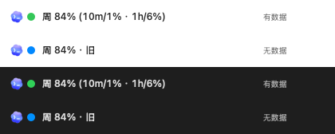
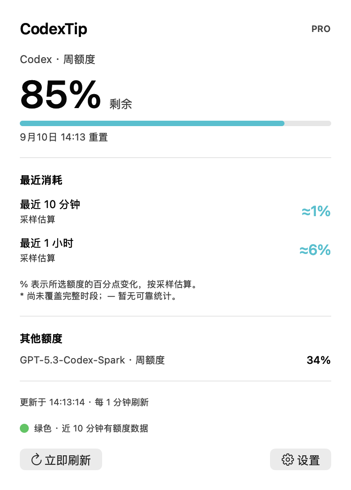
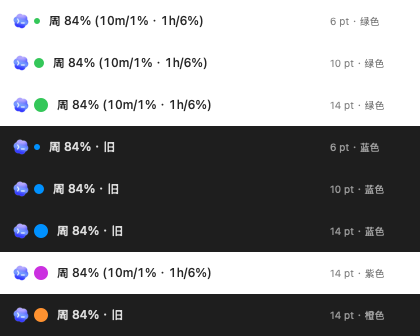

# CodexTip

**原生 macOS 菜单栏 Codex 额度工具，支持简体中文与 English。**

[简体中文](README.md) · [English](README.en.md)

在菜单栏查看剩余额度，同时观察最近 10 分钟、1 小时等时段的消耗。无需打开浏览器，不播放声音，不占用 Dock。

```text
[Codex Logo] 🟢 周 84% (10m/1% · 1h/6%)
```

> 上方数字与下方截图均为演示数据。剩余额度来自服务器，近期消耗通过本机采样估算。





## 功能

- **剩余额度**：显示百分比、真实额度周期及重置时间；支持选择服务器返回的普通 Codex、Spark 等额度。
- **Logo 与状态颜色**：菜单栏用 Codex Logo 代替产品文字。旁边圆点在最近 10 分钟有有效额度采样时默认绿色，否则默认蓝色；大小和两种状态颜色均可设置，鼠标提示与面板也提供文字说明。
- **近期消耗**：默认显示最近 10 分钟、1 小时，可选择 5 / 10 / 30 分钟、1 / 3 / 6 / 24 小时。
- **可调刷新**：1、2、3、5、10 分钟，默认 1 分钟；也可立即刷新。
- **中英文界面**：菜单栏、面板、设置、状态说明与错误提示均支持中文和英文，可跟随系统或手动选择。
- **后台运行**：支持紧凑显示、可选登录时启动、唤醒后立即刷新。
- **本地历史**：保留最近 48 小时采样；识别账户切换、额度重置和采样中断。

这是独立的 macOS 菜单栏 App。它通过本机 Codex App Server 读取额度，不需要在 Codex 插件商店安装，也不修改 Codex 应用。

## 环境要求

| 项目 | 要求 |
| --- | --- |
| 系统 | macOS 13 或更新版本 |
| 构建工具 | Swift 5.9+；安装 Xcode 或 Xcode Command Line Tools |
| Codex | 已安装 Codex / ChatGPT 桌面应用，或支持 App Server 的 Codex CLI |
| 账户 | Codex 已使用能返回订阅额度的 ChatGPT 账户登录；API Key 账户不提供此类订阅额度 |
| 网络 | 刷新时需要连接 Codex 额度服务 |

项目不依赖第三方 Swift 包。当前提供源码构建方式；构建脚本为本机架构生成 App，已在 Apple Silicon Mac 上验证，尚未验证 Intel Mac。

## 安装与启动

如果尚未安装命令行开发工具，先执行并完成系统安装提示：

```bash
xcode-select --install
```

然后下载源码、构建并安装：

```bash
git clone https://github.com/jygameclub/codextip.git
cd codextip
./scripts/install.sh
```

脚本安装到 `~/Applications/CodexTip.app` 并在后台启动，无需管理员权限。安装完成后，在屏幕顶部菜单栏找到 Codex Logo、状态圆点和额度数字。

也可以单独构建和运行：

```bash
./scripts/build.sh
open -g ./dist/CodexTip.app
```

本机构建采用 ad-hoc 签名，适合本机使用。将构建结果分发给其他用户时，需要另行配置 Developer ID 签名与公证。

## 设置与语言

点击菜单栏额度 → **设置 / Settings**。

| 设置项 | 说明 |
| --- | --- |
| 语言 / Language | 跟随系统 / 简体中文 / English，保存后立即生效 |
| 状态圆点大小 | 6、8、10、12、14 pt；默认 10 pt，升级后未设置的用户也使用新默认值 |
| 有数据时 / 无数据时的颜色 | 分别选择绿色、蓝色、青色、橙色、紫色、红色、粉色或黄色；默认绿色 / 蓝色 |
| 刷新间隔 | 每 1、2、3、5、10 分钟；默认 1 分钟 |
| 括号内的统计时段 | 最多显示 3 项，可全部取消；面板始终保留 10 分钟和 1 小时统计 |
| 菜单栏显示哪项额度 | 选择实际返回的额度；近期消耗以所选额度为基准 |
| 紧凑显示 | 菜单栏只显示剩余额度，面板保留详细信息 |
| 登录时启动 | 默认关闭；启用时 macOS 可能要求在登录项中批准 |
| 指定 Codex 可执行文件 | 自动查找失败时，选择名为 `codex` 的可执行文件 |

默认跟随系统：中文系统显示简体中文，其他系统显示英文。也可以手动选择语言；内置 macOS 文件选择器等系统控件可能仍遵循系统语言。已有设置会保留，新增语言设置默认跟随系统。

Codex 自动查找范围包括 `/Applications` 和 `~/Applications` 中的 Codex / ChatGPT 应用、Homebrew、`~/.local/bin` 以及进程的 `PATH`。设置手动路径后，不会自动改用其他可执行文件。

## 如何理解数字

| 显示 | 含义 |
| --- | --- |
| 有数据状态（默认绿色） | 最近 10 分钟内成功采到所选额度的有效百分比；消耗为 0 也属于有数据 |
| 无数据状态（默认蓝色） | 最近 10 分钟无有效采样，例如刚启动、持续断网或长时间休眠 |
| `84%` | 所选额度当前剩余 84% |
| `10m/1%` | 最近 10 分钟大约消耗了总额度的 1 个百分点 |
| `10m/1%*` | 尚未覆盖完整时段，仅统计已记录的部分；面板显示覆盖分钟数 |
| `—` | 刚启动、缺少数据、账户标识不可用、采样中断或期间发生重置，暂无可靠估算 |
| `· 旧` / `· stale` | 刷新失败或数据过期，当前显示上次成功读取的额度 |

菜单栏使用 `10m/1%` 紧凑格式；`/` 左侧是时段，右侧是估算消耗，省略 `≈` 以节省空间。面板仍显示 `≈1%`，`*` 与 `—` 保留原含义。圆点大小和颜色修改后立即生效并自动保存，面板和鼠标提示同步更新颜色名称。



例如，已用额度从 **15% 增至 16%**，消耗记为 **1 个百分点**，不是已用量或剩余量的相对增长率。

圆点表示**数据是否在最近 10 分钟出现过**，不代表额度是否发生消耗。最近一次刷新失败时，只要 10 分钟内仍有有效采样，圆点可以保持有数据时的颜色，同时文字显示「旧」。无新采样也会按时钟重新计算颜色，界面约每 15 秒更新一次状态。

- **首次运行需要积累数据**：完整的 10 分钟 / 1 小时统计，需要对应长度的采样历史，不回推安装前的使用量。
- **账户级统计**：反映同一账户的额度变化，也可能包含其他设备上的使用，并非只统计当前 Mac。
- **采样精度有限**：刷新间隔、服务端更新延迟和返回百分比的粒度都会影响精度。统计边界处于两次有效采样间时，使用线性估算。
- **休眠或断网会出现缺口**：App 无法在电脑休眠、退出或网络不可用时完成采样；恢复后刷新。缺口、重置或调整移出所选时段后，统计自动恢复。
- **周期以接口为准**：`primary` 可能是周额度，不能固定当作 5 小时额度。

## 数据来源与隐私

通过 [OpenAI App Server 文档](https://learn.chatgpt.com/docs/app-server#6-rate-limits-chatgpt) 描述的接口读取数据：

```text
codex app-server --listen stdio://
initialize → initialized → account/rateLimits/read
```

优先使用 `rateLimitsByLimitId`，兼容旧版 `rateLimits`。根据 `usedPercent` 计算剩余百分比，根据 `windowDurationMins` 和 `resetsAt` 显示周期与重置时间。

- 只读取额度，不创建任务、不发起模型生成、不兑换额度重置券。
- CodexTip 自身不读取聊天记录，不读取或复制认证文件，不保存 token；登录和额度请求由本机 Codex App Server 处理。
- 不启动 HTTP 服务、不监听 TCP 端口，不向本项目的服务器上传数据；本项目没有遥测服务。
- 本地历史只保存额度快照、采样时间、间隔和用于账户隔离的 SHA-256 标识。账户变化时清除旧账户比较历史；缺少账户标识时禁用历史比较。

本地文件：

```text
~/Library/Application Support/CodexTip/history.json
~/Library/Application Support/CodexTip/preferences.json
```

目录权限为 `700`，文件权限为 `600`。采样历史保留最近 48 小时，退出和升级后仍可读取。

## 更新与卸载

更新源码并重新安装：

```bash
cd codextip
git pull --ff-only
./scripts/install.sh
```

卸载时，先在设置中关闭「登录时启动」并退出 CodexTip，再在 Finder 中删除 `~/Applications/CodexTip.app`。如需清除历史和设置，同时删除上述 `CodexTip` 数据目录。

## 常见问题

**菜单栏找不到入口？** 确认 App 已启动；菜单栏项目太多或刘海屏空间不足时，macOS 可能隐藏部分项目。可减少其他菜单栏项目，并在 CodexTip 中启用紧凑显示。

**显示无法读取额度？** 确认 Codex 已登录 ChatGPT 账户，网络正常且客户端版本支持 `account/rateLimits/read`。如果使用自定义 CLI 安装位置，在设置中选择正确的 `codex` 文件。当前 App Server 接口未来可能变化，需要相应更新客户端。

**为什么消耗一直是 0%？** 这是服务器返回的额度百分比变化，较小的消耗可能尚未反映出来；它不是精确的 token 计数。

**关闭 Codex 聊天窗口后还能工作吗？** 可以，只要本机 Codex 可执行文件与登录状态仍可用。退出 CodexTip 会停止采样。

## 开发与验证

```bash
swift test
./scripts/build.sh
./dist/CodexTip.app/Contents/MacOS/CodexTip --check --language zh
./dist/CodexTip.app/Contents/MacOS/CodexTip --check --language en
```

测试覆盖近期消耗、采样边界、重置、缺口、账户隔离、历史存储权限、协议握手、超时、语言切换和旧版设置兼容。`--check` 只读一次实际额度，不写历史。

离屏渲染演示界面，不打开前台窗口、不截取桌面：

```bash
./dist/CodexTip.app/Contents/MacOS/CodexTip --render-preview dist/preview-zh.png --language zh
./dist/CodexTip.app/Contents/MacOS/CodexTip --render-preview dist/preview-en.png --language en --dark
./dist/CodexTip.app/Contents/MacOS/CodexTip --render-menu-preview dist/menu-status.png --language zh
./dist/CodexTip.app/Contents/MacOS/CodexTip --render-menu-preview dist/dot-options.png --language zh --dot-options
```

CLI 的 `--language zh|en` 仅用于当前命令，不修改应用保存的设置。

开发协作规则见 [AGENTS.md](AGENTS.md)：每次完成文件修改任务后验证、提交并推送到当前分支；推送后核对远程提交。图标来源与使用方式见 [资源说明](docs/ASSETS.md)。

```text
Sources/CodexTip/           菜单栏、面板和应用入口
Sources/CodexTipCore/       额度读取、统计、存储和语言支持
Tests/CodexTipCoreTests/    自动化测试
Resources/Info.plist       macOS 应用配置
scripts/                   构建与安装脚本
docs/images/               使用演示数据生成的界面预览
```
