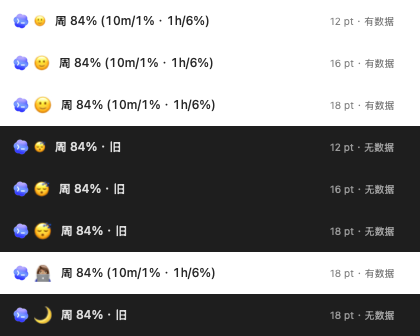
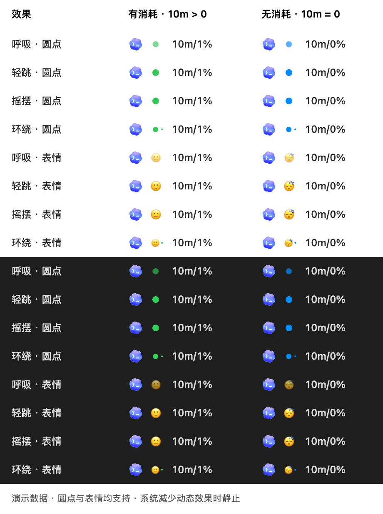
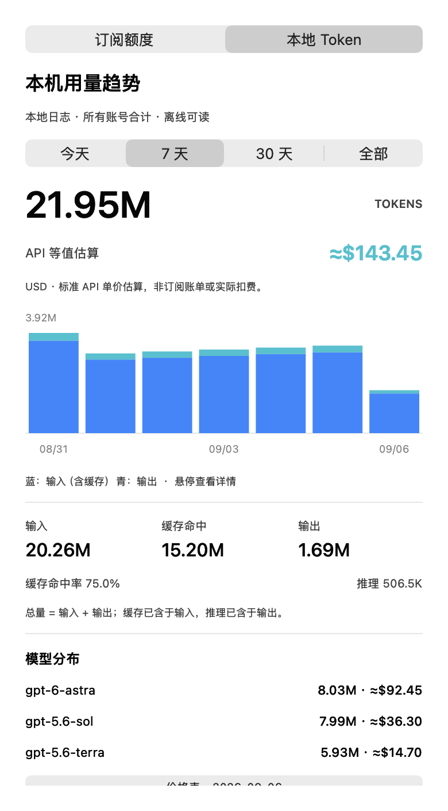

# CodexTip

**原生 macOS 菜单栏 Codex 额度工具，支持简体中文与 English。**

[简体中文](README.md) · [English](README.en.md)

在菜单栏查看剩余额度，同时观察最近 10 分钟、1 小时等时段的消耗。无需打开浏览器，不播放声音，不占用 Dock。

```text
[Codex Logo] 🟢 周 84% (10m/1% · 1h/6%)
```

> 上方数字与下方截图均为演示数据。剩余额度来自服务器，近期消耗通过本机采样估算。


## 功能

- **剩余额度**：显示百分比、真实额度周期及重置时间；支持选择服务器返回的普通 Codex、Spark 等额度。
- **Logo 与状态颜色**：菜单栏用 Codex Logo 代替产品文字。旁边圆点在最近 10 分钟消耗 > 0 时默认绿色，消耗为 0 或暂无可靠统计时默认蓝色；大小和两种状态颜色均可设置，鼠标提示与面板也提供文字说明。
- **表情状态标识**：设置中可将圆点切换为表情；有消耗 / 无消耗（含未知）分别配置，支持预设、自定义单个完整表情及 12 / 14 / 16 / 18 pt 大小。
- **近期消耗**：默认显示最近 10 分钟、1 小时，可选择 5 / 10 / 30 分钟、1 / 3 / 6 / 24 小时。
- **费用估算**：本地 Token 页显示美元 API 等值估算、各模型费用及柱形悬停费用；按输入、缓存读写、输出和长上下文计价，缺价部分明确标注。
- **可调刷新**：1、2、3、5、10 分钟，默认 1 分钟；也可立即刷新。
- **中英文界面**：菜单栏、面板、设置、状态说明与错误提示均支持中文和英文，可跟随系统或手动选择。
- **后台运行**：支持紧凑显示、可选登录时启动、唤醒后立即刷新。
- **额度历史**：保留最近 48 小时采样；识别账户切换、额度重置和采样中断。

- **本地 Token 趋势**：详情中切换「本地 Token」，查看今天 / 7 天 / 30 天 / 全部历史、输入与输出柱状图、缓存命中率、推理用量和模型分布；本机日志合并统计，与当前登录账号无关。

这是独立的 macOS 菜单栏 App。它通过本机 Codex App Server 读取额度，不需要在 Codex 插件商店安装，也不修改 Codex 应用。

## 环境要求

| 项目 | 要求 |
| --- | --- |
| 系统 | macOS 13 或更新版本 |
| 构建工具 | Swift 5.9+；安装 Xcode 或 Xcode Command Line Tools |
| Codex | 已安装 Codex / ChatGPT 桌面应用，或支持 App Server 的 Codex CLI |
| 账户 | Codex 已使用能返回订阅额度的 ChatGPT 账户登录；API Key 账户不提供此类订阅额度 |
| 网络 | 订阅额度刷新需要网络；本地 Token 历史可离线读取，不要求登录 |

项目不依赖第三方 Swift 包。当前提供源码构建方式；构建脚本为本机架构生成 App，已在 Apple Silicon Mac 上验证，尚未验证 Intel Mac。

## 安装与启动

如果尚未安装命令行开发工具，先执行并完成系统安装提示：

```bash
xcode-select --install
```

然后下载源码、构建并安装：

```bash
git clone https://github.com/jygameclub/codextip.git
cd codextip
./scripts/install.sh
```

脚本安装到 `~/Applications/CodexTip.app` 并在后台启动，无需管理员权限。安装完成后，在屏幕顶部菜单栏找到 Codex Logo、状态圆点和额度数字。

也可以单独构建和运行：

```bash
./scripts/build.sh
open -g ./dist/CodexTip.app
```

本机构建采用 ad-hoc 签名，适合本机使用。将构建结果分发给其他用户时，需要另行配置 Developer ID 签名与公证。

## 设置与语言

点击菜单栏额度 → **面板右上角「设置 / Settings」**。「订阅额度」和「本地 Token」两页都能直接打开设置；本地历史滚动时，顶部设置按钮保持可见。

| 设置项 | 说明 |
| --- | --- |
| 语言 / Language | 跟随系统 / 简体中文 / English，保存后立即生效 |
| 状态标识 | 圆点 / 表情；升级默认保留圆点，切换后各自的设置都会保留 |
| 有消耗时 / 无消耗／未知时的动画 | 独立选择静止、呼吸、轻跳、摇摆、环绕；圆点与表情均支持，默认静止 |
| 表情大小 | 表情模式下可选 12、14、16、18 pt；默认 16 pt |
| 有消耗时 / 无消耗（含未知）时的表情 | 表情模式下分别选择预设或「自定义表情…」；默认 🙂 / 😴，保存后立即生效 |
| 状态圆点大小 | 6、8、10、12、14 pt；默认 10 pt，升级后未设置的用户也使用新默认值 |
| 有消耗时 / 无消耗（含未知）时的颜色 | 分别选择绿色、蓝色、青色、橙色、紫色、红色、粉色或黄色；默认绿色 / 蓝色 |
| 刷新间隔 | 每 1、2、3、5、10 分钟；默认 1 分钟 |
| 括号内的统计时段 | 最多显示 3 项，可全部取消；面板始终保留 10 分钟和 1 小时统计 |
| 菜单栏显示哪项额度 | 选择实际返回的额度；近期消耗以所选额度为基准 |
| 紧凑显示 | 菜单栏只显示剩余额度，面板保留详细信息 |
| 登录时启动 | 默认关闭；启用时 macOS 可能要求在登录项中批准 |
| 指定 Codex 可执行文件 | 自动查找失败时，选择名为 `codex` 的可执行文件 |

默认跟随系统：中文系统显示简体中文，其他系统显示英文。也可以手动选择语言；内置 macOS 文件选择器等系统控件可能仍遵循系统语言。已有设置会保留，新增语言设置默认跟随系统。

**使用表情**：设置 →「状态标识」→「表情」，然后重新打开设置，分别选择「有消耗时的表情」「无消耗／未知时的表情」。自定义支持粘贴单个完整表情（如 👩🏽‍💻、🇯🇵、👨‍👩‍👧‍👦）；也可按 `Control + Command + 空格` 打开系统表情面板。空白、普通文字或多个表情不会保存，取消不改变设置。

圆点和表情都按所选额度近 10 分钟的消耗判断状态：> 0 为活跃，≤ 0 为空闲；无可靠统计时使用非活跃外观，并单独提示统计未知。表情保持系统原色；圆点颜色只在圆点模式生效。新表情是否可显示取决于 macOS 自带字库。



**使用动画**：设置 →「有消耗时的动画」或「无消耗／未知时的动画」。建议有消耗用「轻跳」或「环绕」，空闲用「呼吸」或「静止」；想让表情动起来，先把「状态标识」设为「表情」。选项立即保存，升级不自动打开动画。

动画仅作用于状态标识，Logo 和数字位置保持固定。有消耗时每 2.4 秒一轮（10 帧/秒），无消耗／未知时每 4.8 秒一轮（5 帧/秒）。缓存 24 帧，播放时不刷新额度、不扫描日志、不重建面板；系统启用「减少动态效果」或电脑休眠时停止动画。动画表示近期消耗状态，不表示 Codex 正在生成内容。



[查看静态预览](docs/images/animations-zh.png)。

Codex 自动查找范围包括 `/Applications` 和 `~/Applications` 中的 Codex / ChatGPT 应用、Homebrew、`~/.local/bin` 以及进程的 `PATH`。设置手动路径后，不会自动改用其他可执行文件。

## 如何理解数字

| 显示 | 含义 |
| --- | --- |
| 有消耗（默认绿色 / 🙂） | 所选额度最近 10 分钟的估算消耗 > 0；仅采样成功不会进入此状态 |
| 无消耗（默认蓝色 / 😴） | 最近 10 分钟的估算消耗 ≤ 0，如 `10m/0%` |
| 暂无可靠统计（默认蓝色 / 😴） | 数据过期、采样不足、中断，或跨重置且已知消耗为 0；提示显示「暂无可靠统计」，不当成完整时段的 0 |
| `84%` | 所选额度当前剩余 84% |
| `10m/1%` | 最近 10 分钟大约消耗了总额度的 1 个百分点 |
| `10m/1%*` | 尚未覆盖完整时段，仅统计已记录的部分；面板显示覆盖分钟数 |
| `—` | 刚启动、缺少数据、账户标识不可用、采样中断，或只有重置前后两个无法比较的采样，暂无可靠估算 |
| `· 旧` / `· stale` | 刷新失败或数据过期，当前显示上次成功读取的额度 |

菜单栏使用 `10m/1%` 紧凑格式；`/` 左侧是时段，右侧是估算消耗，省略 `≈` 以节省空间。面板仍显示 `≈1%`，`*` 与 `—` 保留原含义。圆点大小和颜色修改后立即生效并自动保存，面板和鼠标提示同步更新颜色名称。


例如，已用额度从 **15% 增至 16%**，消耗记为 **1 个百分点**，不是已用量或剩余量的相对增长率。

**重置后保留近期统计**：10 分钟可以正常显示时，1 小时不会仅因跨过一次额度重置而整段变成 `—`。应用分别累计重置／调整前后的可比较区间，跳过跨重置的那对采样，显示如 `1h/7.4%*`；面板注明「重置／调整区间未计入」及实际覆盖分钟数。不会把额度回补算成消耗，也不会猜测重置区间的用量。若只有跨重置的一对采样，仍显示 `—`；若已知区间合计为 0，则显示 `0%*`，活跃状态保持未知，因为不能确定被排除区间没有消耗。重置移出统计窗口后自动恢复普通显示。原始历史不会因重置删除；其他缺失数据、采样中断、周期变化与账户隔离规则保持不变。

状态使用与 `10m/...` 相同的所选额度消耗计算，按未四舍五入的数值判断；与本地 Token 历史无关。成功刷新且消耗仍为 0 时保持非活跃；过去的消耗移出 10 分钟统计窗口后会切换为空闲。统计窗口以最后一次有效采样为终点；刷新失败或数据过期会切换为未知状态。状态在每次刷新及约每 15 秒检查时更新，不受括号时段和紧凑模式设置影响。旧版的绿色／蓝色、表情选择会原样保留，判定条件更新为近期消耗。

- **首次运行需要积累数据**：完整的 10 分钟 / 1 小时统计，需要对应长度的采样历史，不回推安装前的使用量。
- **账户级统计**：反映同一账户的额度变化，也可能包含其他设备上的使用，并非只统计当前 Mac。
- **采样精度有限**：刷新间隔、服务端更新延迟和返回百分比的粒度都会影响精度。统计边界处于两次有效采样间时，使用线性估算。
- **休眠或断网会出现缺口**：App 无法在电脑休眠、退出或网络不可用时完成采样；恢复后刷新。采样缺口移出所选时段后，统计自动恢复。额度重置按下述规则保留可比较区间。
- **周期以接口为准**：`primary` 可能是周额度，不能固定当作 5 小时额度。


额度突然恢复到 100%（已用量降到 0）也按重置／调整处理，即使服务端重置时间没有变化。补回的额度不计作负消耗；继续累计重置前后可比较区间的消耗，并用 `*` 标记跨重置的部分统计。

## 本地 Token 历史

点击菜单栏 → **本地 Token**。默认查看最近 7 个自然日，可切换今天、30 天或全部历史；今天按小时，7 / 30 天按天，全部历史超过 60 天时按月显示。时间采用 Mac 的本地时区，今天包含已发生的记录；空柱表示该时段没有已记录用量。



- **范围**：读取 `~/.codex/sessions/**/*.jsonl` 与 `~/.codex/archived_sessions/**/*.jsonl`；启动进程设置了 `CODEX_HOME` 时改用该目录。统计包括该目录中不同账号留下的历史，切换账号不会清空本地 Token 统计。
- **即时历史**：首次运行即可索引安装前保留的日志；缺失、删除或未落盘的记录无法恢复，也不会读取其他电脑上的日志。不能将 token 总数直接换算为订阅额度百分比。
- **统计口径**：总量 = 输入 + 输出。缓存命中属于输入子集，推理属于输出子集，不再次累加；鼠标悬停数值或柱形查看准确计数。模型分布显示前 5 项，其余合计。
- **费用**：按内置标准 API 单价显示美元估算，非订阅账单或实际扣费。金额随今天 / 7 天 / 30 天 / 全部时段切换；未知价格显示「已知部分」和未计价用量。价格核对日期及官方入口在面板底部，完整单价与限制见 [费用估算说明](docs/PRICING.md)。
- **刷新**：随设置中的 1 / 2 / 3 / 5 / 10 分钟间隔后台更新，也可点击「刷新本地数据」独立离线刷新。首次扫描较大历史需要数十秒并显示进度；之后用本地索引续读新增行。
- **去重与边界**：去除重复累计快照、同一会话的归档副本、已标记的子任务继承历史；兼容旧版 fork 的父日志前缀匹配。日志格式与继承元数据不完整时，统计可能存在缺失或重复；这不是账单审计数据。
- **小屏幕**：内容超出可用高度时可滚动，仍可切换统计时段和查看底部详情。

参考了 [CodexBar](https://github.com/steipete/CodexBar) 和 [ccusage](https://github.com/ccusage/ccusage) 的本地日志统计方式，使用原生 Swift 独立实现，无需安装这些工具或 Node。研究版本、去重口径和限制见 [本地统计实现说明](docs/LOCAL_TOKEN_USAGE.md)。

## 数据来源与隐私

通过 [OpenAI App Server 文档](https://learn.chatgpt.com/docs/app-server#6-rate-limits-chatgpt) 描述的接口读取数据：

```text
codex app-server --listen stdio://
initialize → initialized → account/rateLimits/read
```

优先使用 `rateLimitsByLimitId`，兼容旧版 `rateLimits`。根据 `usedPercent` 计算剩余百分比，根据 `windowDurationMins` 和 `resetsAt` 显示周期与重置时间。

- 只读获取订阅额度和本地用量，不创建任务、不发起模型生成、不兑换额度重置券。
- 本地索引顺序扫描日志字节，只提取用量与必要元数据，不显示或存储聊天正文、工具输出。不会读取或复制认证文件，不保存认证令牌；登录和额度请求由本机 Codex App Server 处理。
- 不启动 HTTP 服务、不监听 TCP 端口，不向本项目的服务器上传数据；本项目没有遥测服务。
- 本地历史只保存额度快照、采样时间、间隔和用于账户隔离的 SHA-256 标识。账户变化时清除旧账户比较历史；缺少账户标识时禁用历史比较。

本地文件：

```text
~/Library/Application Support/CodexTip/history.json
~/Library/Application Support/CodexTip/preferences.json
~/Library/Application Support/CodexTip/local-token-index.json
```

目录权限为 `700`，文件权限为 `600`。额度采样历史保留最近 48 小时；Token 索引覆盖仍保留在源目录的日志，保存时间、模型、用量、散列会话/文件标识和续读位置，不含账号标识。退出和升级后仍可读取。应用退出后可删除 `local-token-index.json`，下次启动会自动重建，原始日志不会修改。

## 更新与卸载

更新源码并重新安装：

```bash
cd codextip
git pull --ff-only
./scripts/install.sh
```

卸载时，先在设置中关闭「登录时启动」并退出 CodexTip，再在 Finder 中删除 `~/Applications/CodexTip.app`。如需清除历史和设置，同时删除上述 `CodexTip` 数据目录。

## 常见问题

**菜单栏找不到入口？** 确认 App 已启动；菜单栏项目太多或刘海屏空间不足时，macOS 可能隐藏部分项目。可减少其他菜单栏项目，并在 CodexTip 中启用紧凑显示。

**显示无法读取额度？** 确认 Codex 已登录 ChatGPT 账户，网络正常且客户端版本支持 `account/rateLimits/read`。如果使用自定义 CLI 安装位置，在设置中选择正确的 `codex` 文件。当前 App Server 接口未来可能变化，需要相应更新客户端。

**本地 Token 为 0 或 —？** `0` 表示所选时段未找到可用记录，`—` 表示没有找到源日志目录；不可读文件会提示统计可能不完整。仅统计 Codex 实际写入日志的 token，不包含未同步到本机的云端任务。

**为什么消耗一直是 0%？** 这是服务器返回的额度百分比变化，较小的消耗可能尚未反映出来；它不是精确的 token 计数。

**关闭 Codex 聊天窗口后还能工作吗？** 可以，只要本机 Codex 可执行文件与登录状态仍可用。退出 CodexTip 会停止采样。

## 开发与验证

```bash
swift test
./scripts/build.sh
./dist/CodexTip.app/Contents/MacOS/CodexTip --check --language zh
./dist/CodexTip.app/Contents/MacOS/CodexTip --check --language en
```

测试覆盖近期消耗、采样边界、重置、缺口、账户隔离、历史存储权限、协议握手、超时、语言切换和旧版设置兼容。`--check` 只读一次实际额度，不写历史。本地用量测试覆盖累计去重、缓存与推理子集、归档/子任务、日志续读与重写、时区和夏令时。

动画测试覆盖正消耗／零消耗／未知状态、旧设置迁移、缓存复用、静止和减少动态效果、休眠暂停、帧变化及固定 Logo 与宽度。

面板切换会同步调整弹窗尺寸，页签和设置按钮在刷新后仍保持可点击。离屏 AppKit 交互测试覆盖中英文页签反复切换、历史时间范围切换、刷新及滚动后的按钮命中区域；使用演示数据，不显示窗口、不读取真实账号。

离线诊断（仅输出聚合数字，不写索引、不连接账号）：

```bash
./dist/CodexTip.app/Contents/MacOS/CodexTip --local-tokens
./dist/CodexTip.app/Contents/MacOS/CodexTip --local-tokens --benchmark
```

离屏渲染演示界面，不打开前台窗口、不截取桌面：

```bash
./dist/CodexTip.app/Contents/MacOS/CodexTip --render-preview dist/local-tokens-zh.png --language zh --local-preview
./dist/CodexTip.app/Contents/MacOS/CodexTip --render-preview dist/pricing-partial.png --language zh --local-preview --partial-pricing --preview-scroll-end
./dist/CodexTip.app/Contents/MacOS/CodexTip --render-preview dist/preview-zh.png --language zh
./dist/CodexTip.app/Contents/MacOS/CodexTip --render-preview dist/reset-zh.png --language zh --quota-reset-preview
./dist/CodexTip.app/Contents/MacOS/CodexTip --render-preview dist/preview-en.png --language en --dark
./dist/CodexTip.app/Contents/MacOS/CodexTip --render-menu-preview dist/menu-status.png --language zh
./dist/CodexTip.app/Contents/MacOS/CodexTip --render-menu-preview dist/dot-options.png --language zh --dot-options
./dist/CodexTip.app/Contents/MacOS/CodexTip --render-menu-preview dist/emoji-options.png --language zh --emoji-options
./dist/CodexTip.app/Contents/MacOS/CodexTip --render-animation-preview dist/animations.gif --language zh
```

CLI 的 `--language zh|en` 仅用于当前命令，不修改应用保存的设置。

开发协作规则见 [AGENTS.md](AGENTS.md)：每次完成文件修改任务后验证、提交并推送到当前分支；推送后核对远程提交。图标来源与使用方式见 [资源说明](docs/ASSETS.md)。

```text
Sources/CodexTip/           菜单栏、面板和应用入口
Sources/CodexTipCore/       额度读取、统计、存储和语言支持
Tests/CodexTipCoreTests/    核心逻辑测试
Tests/CodexTipUITests/      离屏面板交互回归测试
Resources/Info.plist       macOS 应用配置
scripts/                   构建与安装脚本
docs/images/               使用演示数据生成的界面预览
```
